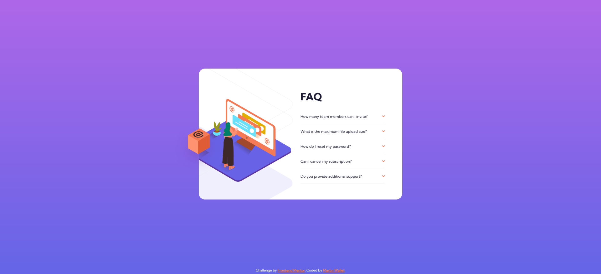

# Frontend Mentor - FAQ accordion card solution

This is a solution to the [FAQ accordion card challenge on Frontend Mentor](https://www.frontendmentor.io/challenges/faq-accordion-card-XlyjD0Oam). Frontend Mentor challenges help you improve your coding skills by building realistic projects.

## Table of contents

- [Overview](#overview)
  - [The challenge](#the-challenge)
  - [Screenshot](#screenshot)
  - [Links](#links)
- [My process](#my-process)
  - [Built with](#built-with)
  - [What I learned](#what-i-learned)
  - [Continued development](#continued-development)
  - [Useful resources](#useful-resources)
- [Author](#author)

## Overview

### The challenge

Users should be able to:

- View the optimal layout for the component depending on their device's screen size
- See hover states for all interactive elements on the page
- Hide/Show the answer to a question when the question is clicked

### Screenshot



### Links

- Solution URL: [GitHub](https://github.com/martinw0/faq_challenge)
- Live Site URL: [GitHub Pages](https://martinw0.github.io/faq_challenge/)

## My process

### Built with

- Semantic HTML5 markup
- CSS custom properties
- Flexbox
- CSS Grid
- Mobile-first workflow
- Sass
- JavaScript

### What I learned

How to rotate an img in css

```css
.rotateimg180 {
  -webkit-transform:rotate(180deg);
  -moz-transform: rotate(180deg);
  -ms-transform: rotate(180deg);
  -o-transform: rotate(180deg);
  transform: rotate(180deg);
}
```

How to use sass mixins:

```scss
$breakpoints: (
    "phone-down": 500px,
    "tablet-up": 768px,
    "tablet-down": 900px,
    "desktop-up": 1024px,
    "desktop-down": 1280px,
    "widescreen-up": 1440px
);
@mixin media-min($_key) {
    @media screen and (min-width: map-get($breakpoints, $_key)) {
        &{ @content; }
    }
}
```

How to skip clickk on a target in js

```js
if (event.target.closest(".question")) return;
```

How to use transform to rotate an element

```css
div img {
    -webkit-transform:rotate(180deg);
    -moz-transform: rotate(180deg);
    -ms-transform: rotate(180deg);
    -o-transform: rotate(180deg);
    transform: rotate(180deg);
}
```

How to define width and height with centered card

```css
left: calc(50vw - 400px);
top: calc(50vh - 30px);
```

### Continued development

### Useful resources

[How to detect click outside div](https://techstacker.com/how-to-detect-clicks-outside-element-javascript/)

## Author

- Frontend Mentor - [@martinw0](https://www.frontendmentor.io/profile/martinw0)
- Twitter - [@leWalletM](https://www.twitter.com/leWalletM)
